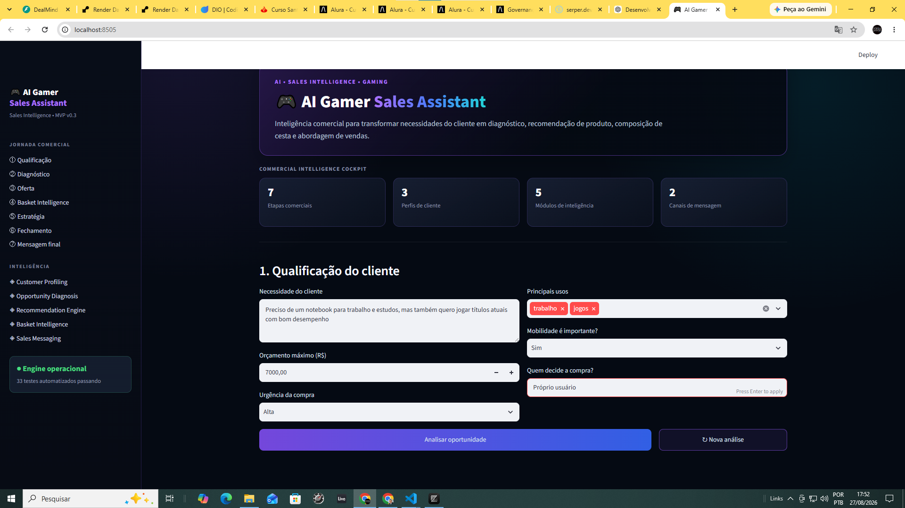
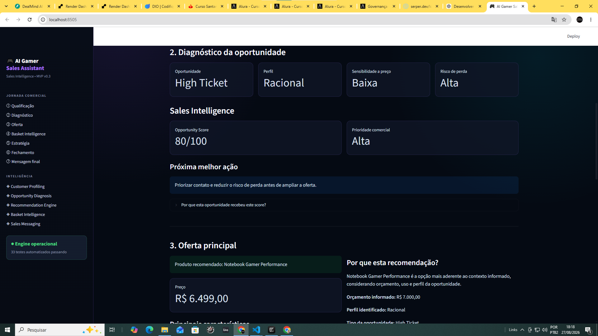
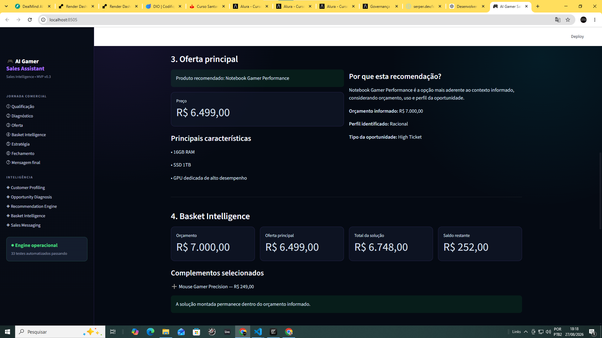

# 🎮 AI Gamer Sales Assistant

### Sales Intelligence MVP para venda consultiva no mercado gamer


O **AI Gamer Sales Assistant** é um MVP de **Sales Intelligence** desenvolvido para apoiar vendedores na condução de vendas consultivas no segmento gamer e de tecnologia.

A aplicação transforma informações sobre necessidade, orçamento, perfil e contexto de compra em uma jornada estruturada de decisão comercial:

**Qualificação → Diagnóstico → Oferta → Basket Intelligence → Estratégia → Fechamento → Mensagem**

O objetivo não é apenas indicar um produto, mas ajudar o vendedor a entender **o que recomendar, por que recomendar e como conduzir a abordagem comercial**.

### 🖥️ Interface do MVP



> **Qualificação comercial:** o vendedor registra necessidade, orçamento, contexto de uso, urgência, mobilidade e decisor para iniciar a análise da oportunidade.

---

## 🚀 Visão do Produto

Em muitos atendimentos comerciais, a conversa começa com uma pergunta simples:

> “Qual produto você procura?”

O problema é que essa abordagem pode ignorar fatores importantes da decisão de compra.

O AI Gamer Sales Assistant trabalha com uma lógica consultiva.

A aplicação considera informações como:

- necessidade do cliente;
- orçamento disponível;
- principais usos;
- urgência;
- importância da mobilidade;
- decisor da compra;
- perfil da oportunidade.

A partir desse contexto, o sistema estrutura uma recomendação comercial e ajuda o vendedor a conduzir as próximas etapas do atendimento.

---

## 🧭 Jornada Comercial

O MVP organiza o atendimento em sete etapas:

### 1. Qualificação

Coleta informações essenciais sobre a oportunidade.

### 2. Diagnóstico

Interpreta o contexto da compra e estrutura o perfil comercial.

### 3. Oferta

Seleciona uma recomendação compatível com as necessidades identificadas.

### 4. Basket Intelligence

Identifica oportunidades coerentes de composição de cesta, incluindo complementos e upgrades.

### 5. Estratégia

Estrutura argumentos comerciais para apoiar a apresentação da solução.

### 6. Fechamento

Organiza a abordagem de fechamento de acordo com o contexto da oportunidade.

### 7. Mensagem final

Gera uma abordagem adaptada para canais digitais de venda.

---

## 🧠 Commercial Intelligence

O projeto foi estruturado em cinco módulos principais de inteligência comercial:

### Customer Profiling

Organiza as informações fornecidas pelo cliente e ajuda a interpretar o contexto da compra.

### Opportunity Diagnosis

Transforma os dados da qualificação em um diagnóstico comercial estruturado.

### 📊 Diagnóstico e priorização comercial



> **Sales Intelligence:** o sistema transforma o contexto da oportunidade em diagnóstico, Opportunity Score, prioridade comercial e Next Best Action.

### Recommendation Engine

Relaciona necessidade, orçamento e características dos produtos para construir recomendações.

### Basket Intelligence

Avalia oportunidades de:

- produto principal;
- upgrade;
- upsell;
- cross-sell;
- composição de cesta.

### 🧺 Recomendação e composição de cesta



> **Basket Intelligence:** a recomendação principal é combinada com complementos aderentes, respeitando o orçamento e preservando a lógica comercial da solução.

### Sales Messaging

Transforma a estratégia comercial em mensagens adequadas ao atendimento digital.

---

## 🖥️ Interface

O MVP possui interface desenvolvida em **Streamlit**, com identidade visual inspirada no universo gamer e estrutura orientada à jornada comercial.

A aplicação apresenta:

- sidebar de navegação;
- hero de posicionamento;
- Commercial Intelligence Cockpit;
- formulário de qualificação;
- diagnóstico comercial;
- recomendações;
- composição de cesta;
- estratégia de abordagem;
- fechamento;
- mensagens comerciais;
- reinício controlado de uma nova análise.

O cockpit resume a arquitetura comercial do produto:

| Indicador | Estrutura |
|---|---:|
| Etapas comerciais | 7 |
| Perfis de cliente | 3 |
| Módulos de inteligência | 5 |
| Canais de mensagem | 2 |

---

## 🏗️ Arquitetura

A aplicação utiliza uma arquitetura modular em Python.

```text
Cliente
   ↓
Interface Streamlit
   ↓
Qualificação
   ↓
Opportunity Diagnosis
   ↓
Customer Profiling
   ↓
Recommendation Engine
   ↓
Catálogo
   ↓
Basket Intelligence
   ↓
Sales Strategy
   ↓
Messaging Engine
   ↓
Resposta Comercial
```

Essa separação permite evoluir cada componente sem concentrar toda a lógica da aplicação na camada de interface.

---

## 📂 Estrutura do Projeto

```text
AI-Gamer-Sales-Assistant/
│
├── app.py
│
├── data/
│   └── products.json
│
├── prompts/
│
├── examples/
│
├── src/
│   ├── __init__.py
│   ├── basket.py
│   ├── catalog.py
│   ├── diagnosis.py
│   ├── message_engine.py
│   ├── models.py
│   ├── recommendation.py
│   └── ui.py
│
├── tests/
│   ├── test_basket.py
│   ├── test_catalog.py
│   ├── test_diagnosis.py
│   ├── test_message_engine.py
│   └── test_recommendation.py
│
├── requirements.txt
├── .gitignore
└── README.md
```

---

## ⚙️ Como o MVP Funciona

O fluxo começa pela qualificação da oportunidade.

O vendedor informa dados como:

```text
Necessidade
Orçamento
Principais usos
Urgência
Mobilidade
Decisor
```

Essas informações alimentam os módulos internos.

```text
Customer Context
       ↓
Opportunity Diagnosis
       ↓
Recommendation Engine
       ↓
Basket Intelligence
       ↓
Commercial Strategy
       ↓
Sales Messaging
```

O resultado é uma abordagem estruturada para apoiar a tomada de decisão do vendedor.

---

## 🛒 Catálogo

O projeto utiliza um catálogo estruturado em:

```text
data/products.json
```

O catálogo permite que o motor de recomendação trabalhe com informações organizadas sobre produtos.

Nesta versão, os dados são utilizados para fins de **demonstração e desenvolvimento do MVP**.

O sistema não consulta preços, estoque ou disponibilidade em tempo real.

---

## 🎯 Recommendation Engine

O motor de recomendação combina informações do cliente com atributos disponíveis no catálogo.

Entre os fatores considerados estão:

- orçamento;
- categoria;
- finalidade de uso;
- nível de desempenho;
- mobilidade;
- adequação ao contexto da compra.

A proposta é evitar recomendações baseadas apenas no produto mais caro ou em uma única variável.

---

## 🧺 Basket Intelligence

Uma venda consultiva não termina necessariamente no produto principal.

O módulo de Basket Intelligence avalia oportunidades de composição de cesta de maneira contextual.

A lógica pode considerar:

```text
Produto principal
      ↓
Complementos
      ↓
Upgrade
      ↓
Upsell
      ↓
Cross-sell
```

O objetivo é aumentar o valor da solução oferecida sem transformar a abordagem em venda forçada.

---

## 💬 Sales Messaging

O projeto possui geração estruturada de mensagens comerciais para dois canais:

- WhatsApp;
- Instagram.

As mensagens utilizam o contexto construído durante a análise comercial para produzir uma abordagem mais coerente com a oportunidade.

---

## 🧪 Testes Automatizados

O MVP possui suíte automatizada utilizando **pytest**.

Atualmente:

```text
42 passed
```

Os testes cobrem componentes centrais como:

- catálogo;
- diagnóstico;
- recomendação;
- Basket Intelligence;
- geração de mensagens.

Para executar:

```bash
python -m pytest -q
```

Resultado esperado:

```text
42 passed
```

---

## ▶️ Executando Localmente

### 1. Clone o repositório

```bash
git clone <URL_DO_REPOSITORIO>
cd AI-Gamer-Sales-Assistant
```

### 2. Crie um ambiente virtual

```bash
python -m venv .venv
```

### 3. Ative o ambiente

Windows PowerShell:

```powershell
.\.venv\Scripts\Activate.ps1
```

### 4. Instale as dependências

```bash
python -m pip install -r requirements.txt
```

### 5. Execute os testes

```bash
python -m pytest -q
```

### 6. Inicie a aplicação

```bash
streamlit run app.py
```

A aplicação será disponibilizada localmente pelo Streamlit.

---

## 🛠️ Stack

### Aplicação

- Python
- Streamlit

### Dados

- JSON
- estruturas e modelos Python

### Engenharia

- arquitetura modular;
- separação entre interface e regras de negócio;
- Git/GitHub;
- ambiente virtual;
- testes automatizados.

### Conceitos de negócio

- Sales Intelligence;
- venda consultiva;
- Customer Profiling;
- Opportunity Diagnosis;
- Recommendation Engine;
- Basket Intelligence;
- upselling;
- cross-selling;
- Sales Messaging.

---

## 🤖 Onde entra Inteligência Artificial?

O projeto nasceu a partir da exploração de **IA Generativa e Prompt Engineering aplicada a vendas**.

Durante sua evolução, parte da lógica comercial foi transformada em componentes determinísticos e testáveis em Python.

Essa decisão permite validar:

- regras de negócio;
- fluxo comercial;
- arquitetura;
- experiência do usuário;
- motores de recomendação;
- composição de cesta;
- mensagens comerciais.

A integração com modelos de linguagem pode ser incorporada posteriormente como uma camada adicional de inteligência.

Isso permite uma evolução arquitetural como:

```text
Sales Intelligence Engine
          +
         LLM
          +
   Knowledge Retrieval
          +
     Sales Tools
          ↓
AI Sales Copilot
```

---

## ⚠️ Escopo e Limitações

O AI Gamer Sales Assistant é atualmente um **MVP demonstrativo**.

A versão atual não possui:

- preços em tempo real;
- estoque em tempo real;
- integração com e-commerce;
- integração com CRM;
- integração direta com WhatsApp;
- integração direta com Instagram;
- autenticação de usuários;
- persistência de histórico comercial;
- métricas reais de conversão;
- integração ativa com API de LLM.

As recomendações devem ser interpretadas como demonstração de uma arquitetura de **Sales Intelligence aplicada à venda consultiva**.

---

## 🗺️ Roadmap

### MVP v0.3

- [x] Interface Streamlit
- [x] Customer Profiling
- [x] Opportunity Diagnosis
- [x] Catálogo estruturado
- [x] Recommendation Engine
- [x] Basket Intelligence
- [x] Sales Messaging
- [x] Commercial Intelligence Cockpit
- [x] Jornada comercial estruturada
- [x] Testes automatizados
- [x] Nova análise / reset do atendimento

### Próximas evoluções

- [ ] Persistência de atendimentos
- [ ] Histórico comercial
- [ ] Dashboard de oportunidades
- [ ] Integração com LLM
- [ ] RAG sobre catálogo e conhecimento comercial
- [ ] Integração com CRM
- [ ] Integração com e-commerce
- [ ] Dados de preço e estoque em tempo real
- [ ] Métricas de conversão
- [ ] Guardrails comerciais
- [ ] Avaliação de recomendações
- [ ] Deploy público

---

## 💼 Aplicações de Negócio

A arquitetura pode ser adaptada para diferentes contextos:

- varejo de tecnologia;
- lojas gamer;
- e-commerce;
- Inside Sales;
- atendimento digital;
- Social Selling;
- treinamento comercial;
- Sales Enablement;
- assistência ao vendedor;
- recomendação de produtos;
- operações comerciais orientadas por dados.

O conceito também pode evoluir para outros segmentos que dependem de venda consultiva.

---

## 📊 Competências Demonstradas

O projeto demonstra integração entre tecnologia e negócio por meio de:

- Python;
- Streamlit;
- testes automatizados;
- arquitetura modular;
- modelagem de regras de negócio;
- sistemas de recomendação;
- Sales Intelligence;
- Customer Profiling;
- vendas consultivas;
- upselling e cross-selling;
- Prompt Engineering;
- IA aplicada a negócios;
- UX orientada a processo comercial;
- Git/GitHub.

---

## 👨‍💻 Autor

**Marcus Guedes**

Gestão de Projetos | Operações & Performance | Data Analytics | IA Aplicada a Negócios

GitHub: **MCLG1661**

---

### 🎮 AI Gamer Sales Assistant

**Transformando contexto de compra em inteligência para vender melhor.**
